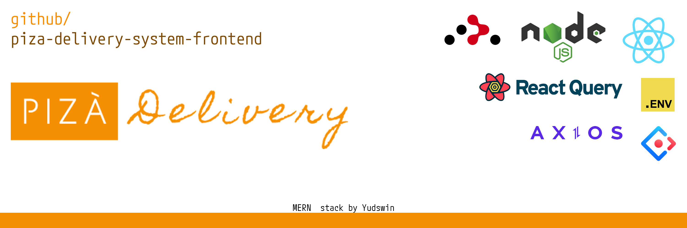

<p align="center">
  <a href="#">  </a>
</p>

# PiZà Delivery System Frontend


## 🎆 Description 

Welcome to the PiZà Delivery System! This project is a React-based frontend implementation of a dynamic food ordering system. 

## ⚒️ Installation

To set up the frontend, follow these simple steps:

1. Clone the repository
2. Run `npm install` to install the necessary dependencies

## 🎆 Prerequisites

Before you embark on this journey, make sure you have the following prerequisites in place:

* The latest version of [Node.js and npm](https://nodejs.org/en/download/) installed on your system.
* Essential npm packages:

```bash
@ant-design/icons@5.2.6
@babel/plugin-proposal-private-property-in-object@7.21.11
@reduxjs/toolkit@2.0.1
@tanstack/react-query-devtools@5.14.2
@tanstack/react-query@5.14.2
@testing-library/jest-dom@5.17.0
@testing-library/react@13.4.0
@testing-library/user-event@13.5.0
antd-table-saveas-excel@2.2.1
antd@5.12.1
axios@1.6.2
dotenv@16.3.1
jwt-decode@4.0.0
react-dom@18.2.0
react-headroom@3.2.1
react-icons@4.12.0
react-redux@9.0.2
react-router-dom@6.20.1
react-scripts@5.0.1
react-slick@0.29.0
react-slick@0.29.0
react@18.2.0
redux-persist@6.0.0
slick-carousel@1.8.1
styled-components@6.1.1
web-vitals@2.1.4
```

## 🏗️ Structure

`src/`: The primary directory for the application's source code.
- `components/`: Contains all the React components utilized throughout the application.
- `hooks/`: Houses the custom React hooks used in the application.
- `pages/`: Defines the main pages or views of the application.
- `redux/`: Contains the Redux store, actions, and reducers for state management.
- `routes/`: Presumably contains the routing configuration for the application.
- `services/`: Typically includes any services the application uses, such as API calls.

## ▶️ Usage

To start the server, run `npm start`.

The backend for this project can be found at [PiZà Delivery System Backend](https://github.com/yudswin/piza-delivery-system-backend).

## 💁🏻 Contributing

If you want to contribute to this project, please open an issue or a pull request.
